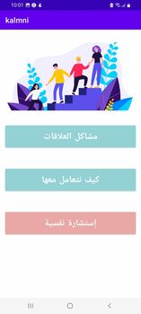

# kalmni
J'ai développé Kalmni, une application mobile Android dédiée à l'accès aux services de psychothérapie. Elle propose une solution pratique permettant de trouver et de s'inscrire facilement à des séances adaptées. 
Kalmni offre une plateforme intuitive et sécurisée, simplifiant ainsi la recherche et la réservation de séances de psychothérapie. 
Avec une interface conviviale, l'application vise à faciliter l'accès aux services de santé mentale, améliorant ainsi le bien-être des utilisateurs

[English]

I developed Kalmni, an Android mobile application designed to facilitate access to psychotherapy services. It offers a practical solution for easily finding and registering for tailored therapy sessions. 
Kalmni provides an intuitive and secure platform, simplifying the search and booking of therapy sessions. 
With a user-friendly interface, the app aims to streamline access to mental health services, enhancing the well-being of users.

Ecran de lancement:

Dashboard:

Page de détails:

